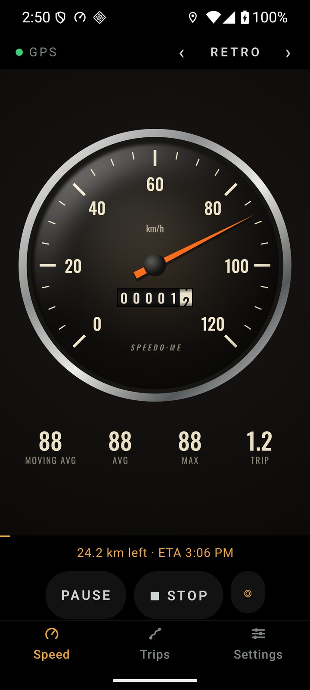
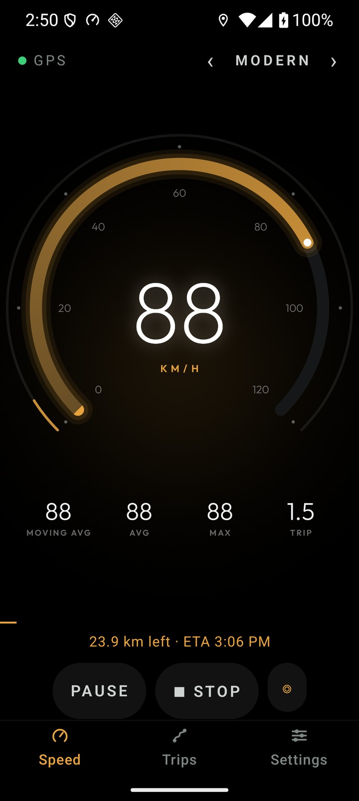
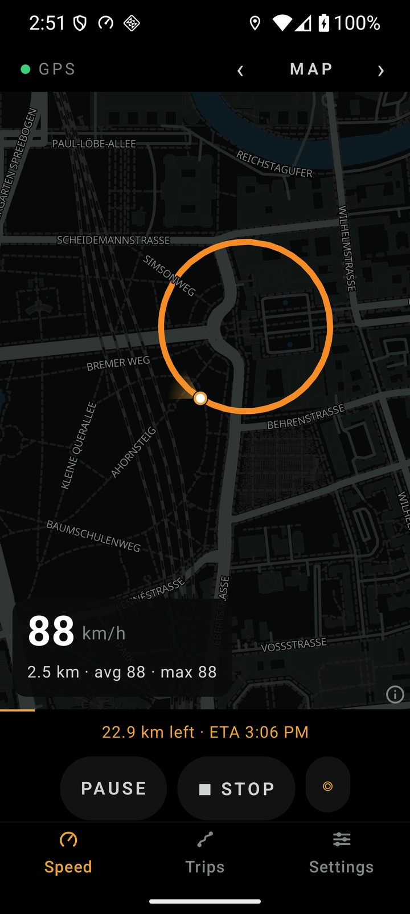
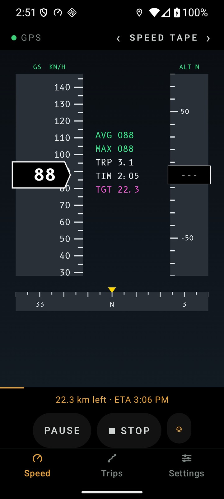
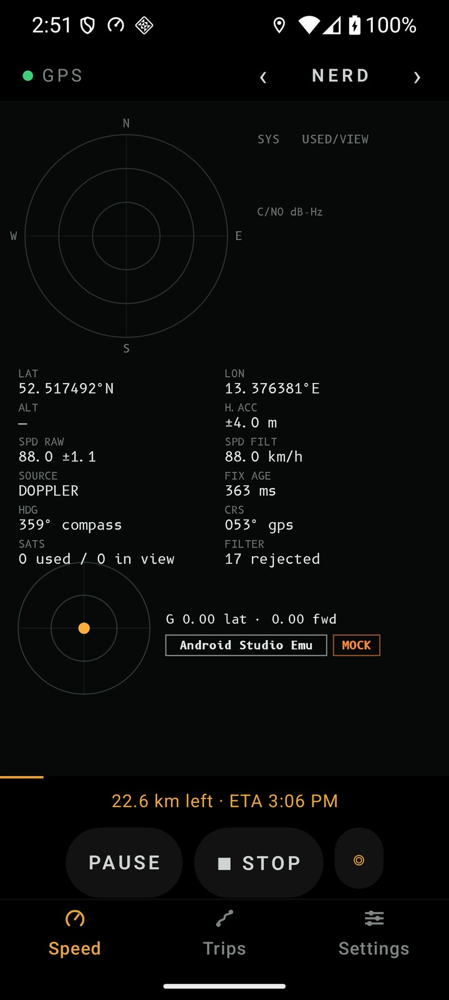

# SpeedoME

An Android GPS speedometer and trip computer that shows the speed your GPS chip actually measures, without the 200 km/h glitches.

> **Status: 0.10, feature-complete.** All planned milestones are implemented and verified on the emulator; 0.10 adds the speed limit and trip maps. What's left before 1.0 is the on-phone checks (screen-off drives, battery, Doze) listed in [`docs/progress.md`](docs/progress.md). [Privacy policy](docs/privacy.md). The roadmap is in [`docs/plan.md`](docs/plan.md) and progress in [`docs/progress.md`](docs/progress.md).

<p>
  
  
  
  
  
</p>

## Features

- **Honest speed:** uses the GPS chip's own Doppler speed, cleaned by a Kalman filter that rejects impossible jumps but never real high speeds (trains and planes included).
- **Auto-range dial** that grows as you speed up and shrinks back afterwards. How it shrinks is configurable, and it can be switched off.
- **Eight themes:** Retro, Modern, Digital, Night Focus, Map, Nerd, Speed Tape and Sunlight. You can try them all in the [Theme Lab](docs/theme-lab.html): download it and open it in a browser, then drive with the keyboard.
- **Speed limit:** dials and bars fix at 25 % over the limit with the top in red; the needle and digits turn red over the last 10 %, and the phone buzzes at the limit, then pulses faster the further over you go.
- **Trip computer:** moving and overall averages, max speed, distance, target distance with arrival time, and an "arrive by" mode.
- **Drive and step modes:** step mode adds step count, cadence and pace.
- **Trips** that survive the app being killed, with a history, a map of each route and GPX export.
- **Light when idle:** without a recording, the speedometer runs only while the app is open. Close it and nothing keeps running.
- **Nerd page:** satellite sky plot, per-constellation signal strength, raw NMEA and a G-force meter.
- **Private by design:** no Google Play Services, no account, no analytics. Your trips stay on your phone.

## Building

Requirements: JDK 17+, and the Android SDK with platform 37 (`compileSdk 37`).

```sh
./gradlew check                  # unit tests + lint
./gradlew :app:assembleDebug     # one APK per ABI in app/build/outputs/apk/debug/
adb install -r app/build/outputs/apk/debug/app-arm64-v8a-debug.apk   # most phones; x86_64 for the emulator
```

The debug build installs as **SpeedoME Dev** (`com.sappy.SpeedoMe.debug`), alongside the release build (`com.sappy.SpeedoMe`).

### Release signing

Copy `keystore.properties.example` to `keystore.properties`, which is git-ignored, and fill in your keystore details. Then run:

```sh
./gradlew :app:assembleRelease   # app-arm64-v8a-release.apk (~15 MB) and friends, plus app-universal-release.apk
```

## Testing with fake GPS

The debug build can act as Android's mock location provider, so every theme can be driven from a PC:

```sh
tools/mockstream.py --synthetic 60           # a 60 km/h loop (grants the mock-location app-op first)
tools/mockstream.py drive.gpx --rate 2       # replay a GPX track; CSV rows of lat,lon[,kmh[,acc]] also work
tools/mockstream.py --synthetic 6 --nospeed  # no Doppler speed: exercises the position fallback
```

Single fixes go through the adb hook: `adb shell am broadcast -p com.sappy.SpeedoMe.debug -a speedome.MOCK_FIX --es latS 52.52 --es lonS 13.40 --ef kmh 48`, and `-a speedome.MOCK_STOP` removes the test provider. Developer options (tap Version seven times in Settings) add the in-app simulator and a raw GPS logger whose files replay into engine tests.

## Project layout

| Path | What lives there |
|---|---|
| `engine/` | Pure Kotlin with no Android code: speed filter, trip stats, auto-range and arrival-time maths. Unit-tested on the JVM. |
| `gauges/` | Jetpack Compose gauge toolkit and themes. |
| `app/` | The Android app: tracking service, sensors, storage and screens. |
| `docs/` | The design and implementation plan, and the Theme Lab mockup. |
| `tools/` | Emulator helper (`emu.sh`) and the mock GPS streamer (`mockstream.py`). |

## License

SpeedoME is free software under the [GNU General Public License v3.0 or later](LICENSE).

The Map theme uses [MapLibre Native](https://maplibre.org) (BSD-2-Clause) with vector tiles from [OpenFreeMap](https://openfreemap.org): © [OpenMapTiles](https://www.openmaptiles.org), data © [OpenStreetMap](https://www.openstreetmap.org/copyright) contributors. Gauge fonts are under the SIL Open Font License (see `gauges/src/main/assets/licenses`).
